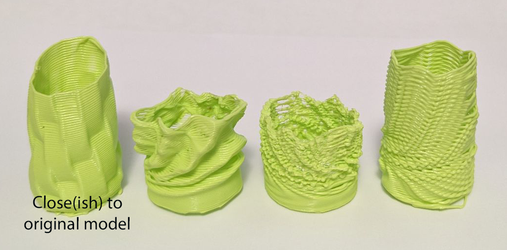

# GCodeHopper
### An interface for #d Printing GCODE & Other Applications

this project was inspired by [Heinz-Loepmeier's NozzleBoss](https://github.com/Heinz-Loepmeier/nozzleboss), and is, in its most basic sense, a framework to parse in pre-sliced 3d printer GCODE, import it into other applications, then re-parse the results back into 3d printing GCODE. it is an interface for modifying GCODE.

While still very much so a work in progress, this tool takes a [GCODE File](https://all3dp.com/2/3d-printer-g-code-commands-list-tutorial/), converts it into an "Encoded Representation". This encoded representation is encapsulates the positon of the 3D printer tool head at all states it would exist in during the course of the print. This intermediary form can then be converted into a format in which other tooling can modify it, then re-import the modified results into GCodeHopper as an Encoded representation, which can finally be exported as a new gcode file, and finally printed.

The specific use case for this tool was utilizing Rhino's Grashopper tool to apply complex modifications & stretching to the toolpaths, but the general goal was to make a flexible framework which was not tool specific.

In terms of design philosopy, GCodeHopper aims to follow OOP principles in all parts of the process, being as refactorable as possible. In essence it was aimed at being practice in writing good code, even though not strictly necescarry for this relatively small use case.

Im also well aware of other open source projects which aim to parse & modify GCODE, but this was, in some ways, an excuse to practice coding a tool from scratch, so gimme a break..

The general structure is as follows:

## GCode Parsing

Each line of a gcode file is of the form:

    COMMAND - ARG1 ARG2 ... ARGn; Comment

    where ARGs are generally of the form X123.22 Y22.3 e.g. [Varname][Value]

these lines are parsed in as [GCodeLine Objects](https://github.com/dyami0123/GCodeHopper/blob/main/src/gcodehopper/gcode_parsing/gcode_line.py) via the "from_string" method. As object, they expose their command types (e.g. G1, G2, Exx) and their various variable values via a public API. e.g. if some code wants access to the "X" value of the specific line object, it uses the line.X property which is populated based parsing of the underlying string

there is also a parsing of comments done at this stage, but the details of this are to be fleshed out.

## Encoded Representation

The Encoded representation is made up of two main pieces. 
- A [RepresentationState](https://github.com/dyami0123/GCodeHopper/blob/main/src/gcodehopper/encoded_representation/representation_state.py) object, and
- A set of [Actions](https://github.com/dyami0123/GCodeHopper/blob/main/src/gcodehopper/encoded_representation/actions/abstract_action.py) which update & modify the state. 

The simplest example of this is the move command. Lets say our current state has the tool head at X0,Y0,Z0 and we have a gcode command coming in next that increases the X value by 10. This is represented as an [Action](https://github.com/dyami0123/GCodeHopper/blob/main/src/gcodehopper/encoded_representation/actions/abstract_action.py) which can be applied to a state (modifing it). in the case of our [simple move action](https://github.com/dyami0123/GCodeHopper/blob/main/src/gcodehopper/encoded_representation/actions/move_action.py) our tool coordinates would be updated by the X of the Action object (which was set by the parsed value from the source GCodeLine). 

Each Action type is its own, distinct class, inheriting from the AbstractAction AbstractBaseClass which requires an apply_to_state method to be defined. The apply to state method takes in an existing RepresentationState object, and produces a new RepresentationState object (without modify the input state).

In this way, with a set of actions and a starting state GCodeHopper can encapsulate all positions that a gcode file describes.

### Generating an Encoded Representation

The conversion from GcodeLines to Actions is done via a factory pattern ([see ActionFactory for details](https://github.com/dyami0123/GCodeHopper/blob/main/src/gcodehopper/gcode_parsing/action_factory.py)). In essence, this factory, takes in a GCodeLine object and spits out an Action object which corresponds to the type of command: e.g. a G2 command will get mapped to a MoveAction object.

## Application Export/Import [WIP]

This aspect of the project is still in active development, but generally speaking, the next goal was to export the encoded representations into [Rhino's grashopper extention](https://www.grasshopper3d.com/). This is a visual modelling software which works like code in alot of ways, but allows for "relatively easy" (still quite hard) algorithmic 3D modelling.

The general appraoch is going to be as follows:

0. save the encoded representaiton to YAML or other file type
1. parse the tool X,Y,Z coordinates into a line segment which shows the 3d representation of the print within Grasshopper.
2. parse the tool extrusion amount, state (infill, exterior perimeter, etc.), and other parameters via "shadow" line segments.
    - the reason for this being that in some cases non tool position parameters will need to be updated in order to compensate for the changes. e.g. a move path gets extended, the extrusion amount will need to be raised so that the right amount of filament gets extruded.
3. use a grasshopper to modify the XYZ data (and shadow datapoints)
4. export back into YAML, etc.

## Test Examples

Here are some wobbly 3d prints from a previous implementation which I find quite interesting printed in a nice green PLA. 

Theres obviously some danger in this of the print failing due to the nozzle hitting the part, but thats part of the fun isnt it? maybe this software will accomodate for that some day....?

